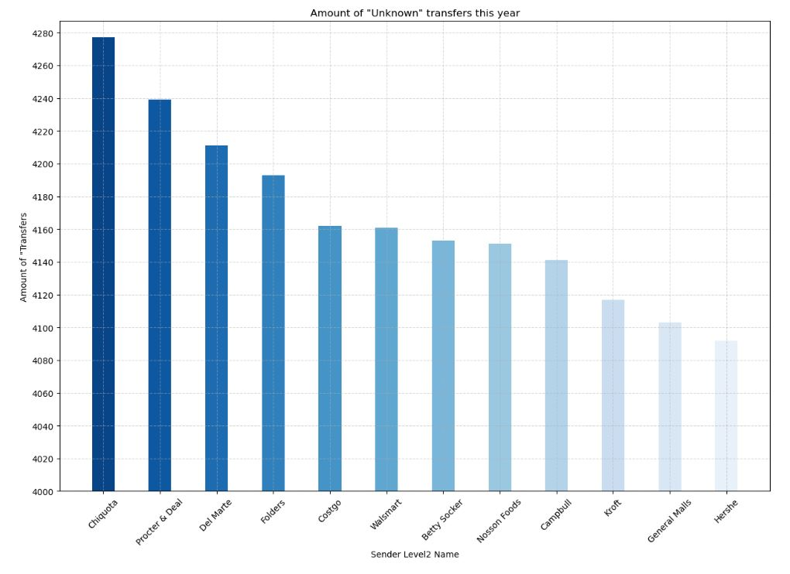
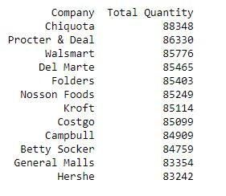

# Python_Project

## Overview of Analysis
Created mock data of "Unknown" transfers of unassigned accounts to show the potential of what Python can accomplish.

## Technology used
* Python
* Matplotlib
* Pandas
* Seaborn
* Jupyter Notebook
* [Mock data CSV created for this project](https://github.com/anrobertson/Python_Project/blob/main/mock_data.csv) 

## The process
### What are the challenges I would like to investigate?
Before starting to create the mock data for this project, I wanted to think of a good example of when utilizing Python could help us answer questions we may have about the business and even open up more conversations of ways to improve in different areas.
When working on the unassigned accounts, I noticed a pattern of which unassigned accounts appeared on the unknown list more frequently then others. 
 Through these patterns I had the questions of:  
* What unassigned accounts should we evaluate and possibly be in touch with for the time being?
* For each unassigned account, how many pallets did they ship out that were considered "unknown"?
* How many unknown transfers have they had each month?
* What actions can we take so we can provide help to these unassigned accounts?

### Creating the mock data
To execute this project, I wanted to replicate the data I see as closely as possible. From the original data I had used the same headers but anything within those columns is completely fictional. 
I used the Faker Library in Python to generate a large amount of mock data (50,000 rows of data). If you would like to see the code scripted to create the mock data, [please click here to be directed to the "Creation of Mock Data.ipynb".](https://github.com/anrobertson/Python_Project/blob/main/Creation%20of%20Mock%20Data.ipynb)

### Utilizing the mock data for research
My goal was to create something that would be easy for someone both inside and outside of the team to understand. I imported the dependencies needed to create the graphs then loaded the CSV file with the mock data to create the a bar graph with correlating line graphs. If you would like to view the code scripted for the analysis, [please click here to be directed to the "Transfer_Data.ipynb".](https://github.com/anrobertson/Python_Project/blob/main/Transfer_Data.ipynb)
  
 **The first step was to analyze the unassigned accounts.** 
  
 When analyzing the data we can see that Chiquota, Proctor & Deal, Del Marte and Folders had the most amount of "unknown" transfers this year so far. This had raised another question: how many pallets were flagged as unknown for each company? 
  
 **Next step was to break down each company and pull out the quantity of pallets they had sent out that had been flagged as "unknown".** 
  
  
 When broken down a little further the data shows that Chiquota, Proctor & Deal and Del Marte remained at the top of our list; however, Walsmart ended up having more unknown pallets shipped than both Folders and Costgo. 

 **The final analysis I wanted to look into was the amount of transfers listed as unknown on a monthly basis** 
   
   
 Viewing this can open up the conversation of when a spike of unknown transfers may have occured and why they may have been overlooked. 

## Summary
Even though this is a small example of what Python can do, I believe that there is a lot of potential with utilizing this tool. Python's flexibility, extensive libraries, and machine learning capabilities make it a valuable tool for account health monitoring and improvement. By leveraging data-driven insights and automation, we can proactively address account-related issues, enhance customer satisfaction, and optimize business outcomes.
